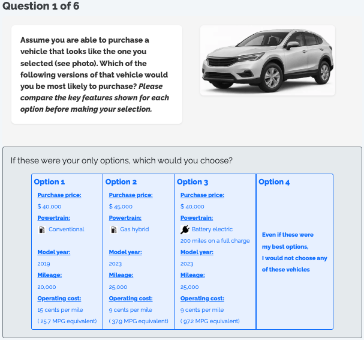
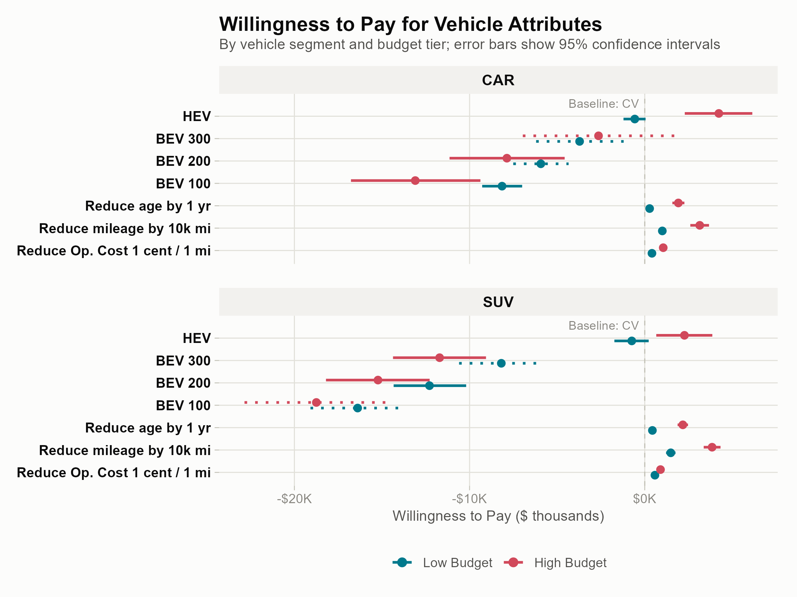
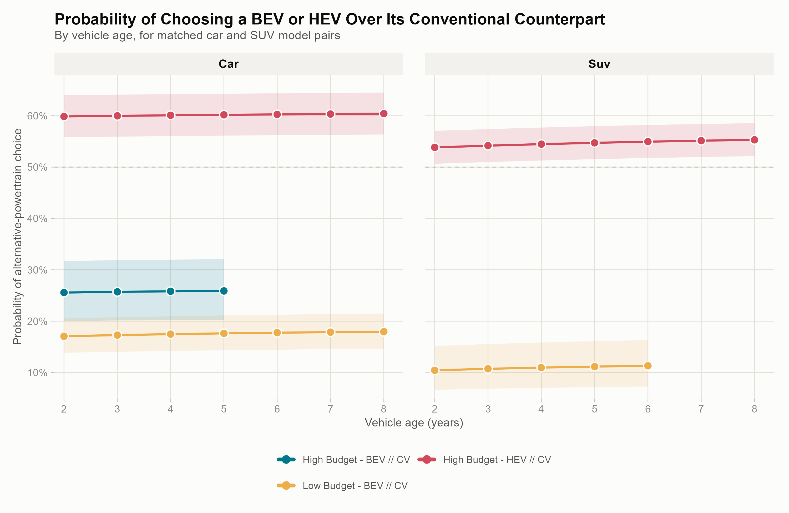

<!-- _class: lead -->

# Consumer Preferences in the Used Vehicle Market

### Willingness to Pay for Powertrain Type, Driving Range, Vehicle Condition, and Operating Cost

Hoda, Iogansen, Gore, Kneifel, Ranganath, Helveston
GWU / NIST Applied Economics Office

<!--
15-minute talk. Introduce yourself briefly, then move fast — this deck has ~14
slides for ~15 minutes, so keep the motivation slides short and save time for
the results (slides 7-10), which are the core of the talk.
-->

---

## Why the used-vehicle market?

- Used vehicles are **~70% of all U.S. vehicle transactions** — but EV research has focused almost entirely on **new-vehicle buyers**
- The used-BEV market is growing fast, and it matters beyond its own transaction volume:
  - Extends vehicle and battery lifetimes, supports a circular economy
  - Lowers the effective cost of EV ownership for lower- and middle-income households
  - Underpins new-vehicle residual values (which affect new-EV leasing economics)
- Used BEVs face **extra** friction new EVs don't: uncertainty about prior condition/reliability, and battery aging that odometer + age alone don't fully signal

<!--
Frame this as: everyone studies new EV adoption, almost nobody studies the
used side, even though it's the bigger market and has its own distinct
barriers (condition uncertainty, battery health uncertainty).
-->

---

## Research questions

This study estimates willingness to pay (WTP) for vehicle attributes among prospective **used** car/SUV buyers, and asks:

1. **How do WTP estimates for vehicle attributes** (powertrain, range, age, mileage, operating cost) **compare across vehicle segment and budget tier?**

2. **How do existing used BEVs compete against their conventional or hybrid counterparts** as vehicles age, in the real market?

<!--
These are literally the two subsection headers in the Analysis section (Q1,
Q2) — keep the framing identical to the paper so the audience can map talk
structure to any handout.
-->

---

## Survey & choice experiment

- **2,254 respondents** planning a used car/SUV purchase within two years (Dynata + Prolific)
- Each completes **6 choice tasks**: pick among 3 hypothetical used vehicles, or "none of these"
- Attributes varied: **powertrain** (ICEV/HEV/BEV), **price**, **operating cost**, **driving range** (BEV only), **age**, **mileage**
- Design stratified by **vehicle body type × budget tier** (4 versions), so attribute ranges match a plausible purchase context

<!--
Point at the image: this is literally what a respondent saw. Walk through one
row to show the attribute list. Mention respondents picked their own
budget and a vehicle image (car or SUV style) before the DCE tasks, which is
what drove the 4-way stratification.
-->

---

## Sample & modeling strategy

- Six **mixed logit (MXL)** models estimated in **willingness-to-pay space**, stratified by:
  - **Vehicle segment**: Car vs. SUV
  - **Budget tier**: Low (≤$20K) vs. High (>$20K)
- Panel-corrected (6 repeated choices per respondent), 5,000 Sobol draws, 10 multi-starts per model
- Why mixed logit, not plain multinomial logit?
  - Avoids the implausible IIA assumption (BEV/HEV/ICEV aren't interchangeable substitutes)
  - Lets us test whether preferences are **genuinely heterogeneous** across respondents — and they are, for almost every attribute

<!--
Keep this slide light on math — the audience wants the *why*, not the
likelihood function. The key sentence to say out loud: "estimating directly
in dollar terms lets us read willingness-to-pay off the model with no extra
post-processing."
-->

---

## Q1 — Willingness to pay for vehicle attributes

<!--
This is the main results figure. Walk it top to bottom for one panel (say
CAR) before comparing to SUV. Key points to hit verbally:
- HEV: real premium for high-budget buyers (~$4,200 car / ~$2,300 SUV),
  no premium for low-budget buyers
- BEV: penalty everywhere, but shrinks sharply as range rises
- Only high-budget car buyers at 300-mile range get statistically
  indistinguishable-from-zero BEV penalty
-->

---

## Powertrain findings

- **HEV**: high-budget buyers place a real premium on hybrids — **~$4,200** (car), **~$2,300** (SUV) — low-budget buyers show no premium
- **BEV**: penalty relative to conventional vehicles everywhere, but it **narrows sharply with range**:

| | 100 mi range | 300 mi range |
|---|---|---|
| Car, high budget | –\$13,100 | **–\$2,600** (≈ parity) |
| Car, low budget | –\$8,200 | –\$3,700 |
| SUV, high budget | –\$18,800 | –\$11,700 |
| SUV, low budget | –\$16,400 | –\$8,200 |

<!--
The "≈ parity" cell (car, high-budget, 300mi) is the one combination where
the confidence interval spans zero — i.e. not statistically different from
a conventional vehicle. Emphasize that this is the ONLY such combination, and
that added range is the single most effective lever for closing the BEV
valuation gap, especially for higher-budget car buyers.
-->

---

## Condition attributes: age, mileage, operating cost

- All three penalize used-BEV value, and **penalties scale with budget tier** (high-budget buyers show larger dollar penalties for the same attribute)
- **Mileage is the largest penalty** of the three: –$1,000 to –$3,800 across segments/tiers
- **Vehicle age**: –$300 to –$2,200
- **Operating cost**: –$400 to –$1,100 (smaller than age for high-budget buyers)
- **SUV buyers show systematically larger penalties than car buyers** at the same budget tier for BEV, mileage, and age — operating cost reverses at the high-budget tier (car penalty larger there)

<!--
Don't over-narrate every number — the table is there to point at. The
takeaway sentence: "the BEV gap is narrowest, and closest to parity, among
higher-budget car buyers buying longer-range vehicles."
-->

---

## Q2 — Do real used BEVs compete with conventional vehicles?

- **Market-share simulation** (Helveston et al. 2014 approach): predicted choice probability between a real used BEV/HEV and its closest matched conventional counterpart, ages 2–8 years
- 5 matched real-market vehicle pairs (3 car, 2 SUV)

<!--
Explain the dashed 50% line = choice parity. Two HEV pairings sit above it
across the ENTIRE age range already. No BEV pairing gets close at any age.
-->

---

## Market-share takeaways

- **Two HEV-vs-conventional pairings already exceed 50% share at every observed age**: high-budget car (~60%), high-budget SUV (~54–55%)
- **No BEV-vs-conventional pairing approaches parity** at any age: 26% (car, high budget), 17–18% (car, low budget), 10–11% (SUV, low budget)
- Predicted share is **nearly flat with vehicle age** across all five pairings (≤ 2 points of movement) — faster real-market BEV/HEV price depreciation roughly offsets the age penalty from the choice model, rather than closing the gap over time

**Bottom line: hybrids are already market-competitive used-vehicle substitutes; BEVs are not yet, regardless of age.**

<!--
This is a good place to pause and let the finding land — it's the most
counter-intuitive result in the paper (many would expect BEV share to climb
with age due to steep depreciation).
-->

---

## Policy implications

- The federal used clean-vehicle credit (§25E, up to **\$4,000**/30% of price) only closes the gap for buyers **already closest to parity** (high-budget car buyers, long range) — it's a fraction of the \$8K–\$19K gap facing most other segments
- The **\$25,000 price cap** on that credit excludes many of the 250–300-mile-range used BEVs that are closest to competitive, while subsidizing shorter-range vehicles the credit can't make competitive anyway
- **~\$15,000–\$20,000** of the age-related WTP gap exceeds normal depreciation — plausibly a **battery state-of-health information gap**, addressable via disclosure/certification/warranties rather than cash transfers
- **Segment-aware policy** — and continued promotion of HEVs, which are already market-competitive — looks more efficient than uniform subsidies

<!--
This slide is dense; pick 2 of the 4 bullets to actually speak to in detail
depending on audience (policy audience → credit design bullets; industry
audience → HEV/battery-health bullets).
-->

---

## Conclusion

- **Driving range and vehicle age are the dominant value determinants** for used BEVs — effects that swamp budget tier or vehicle segment alone
- Used BEVs reach price parity with conventional vehicles in **only one segment**: high-budget car buyers, 300-mile range
- **Hybrids are already there** — matching or beating conventional vehicles in predicted market share for high-budget car/SUV buyers, at every observed age
- For everyone else, the used-BEV discount required is large, predictable, and currently under-served by existing incentive design

<!--
This is the "if they remember one slide" slide. Say the four bullets slowly.
-->

---

## Limitations

- Stated, not revealed, preferences — hypothetical bias possible (direction uncertain)
- Online panel sample may over-represent information-engaged consumers
- MXL assumes continuous normal heterogeneity — a latent-class model would test for discrete preference clusters directly
- Battery state-of-health was not varied in this DCE (covered in a companion battery-attribute DCE)

<!--
Quick slide, ~30 seconds. Don't dwell — just show you've thought about it.
-->

---

<!-- _class: lead -->

# Questions?

Zain Hoda · zain.hoda@gwu.edu

<!--
Leave this up during Q&A.
-->
